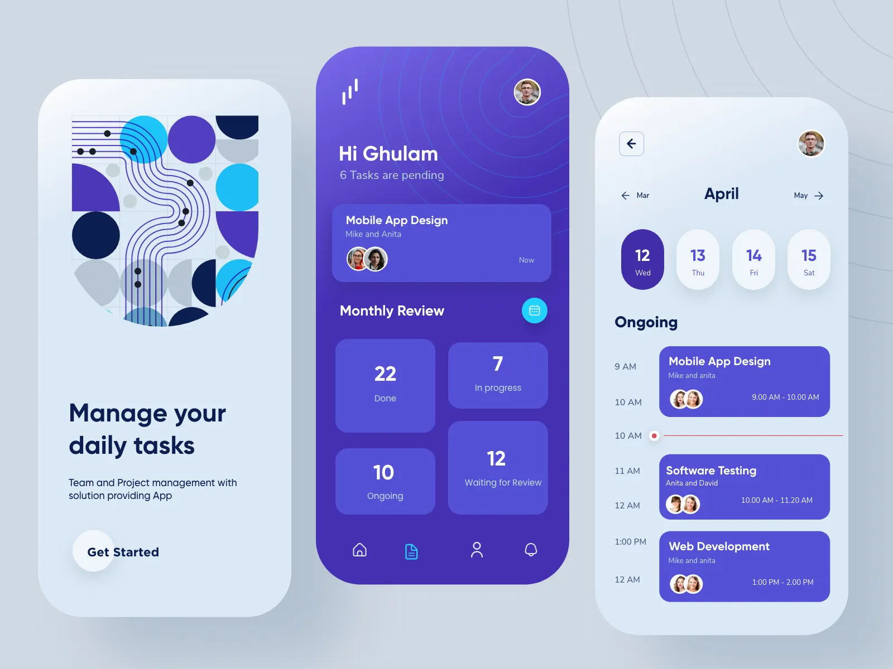

# 📝 Task Management App UI

The first project from **Design-To-Code** series.
A stunning **3-page UI design**, implemented as a Mobile Application with **Flutter**.
Easy-to-follow structure, and a few extra functionalities added for fun.


## 🔎 Project Details
- architecture -> **MVVM** (minimal setup)
- State Management -> **Provider**
- Dependency Injection -> ProxyProvider
- Navigation -> Navigator + MaterialPageRoute


## 🎬 Demo
<p align="center">
  
</p>


## 🎨 Design Reference
<p align="center">
  
</p>


### Installation
```bash
git clone https://github.com/AmirRezaAlami/design-to-code-1.git
cd task_management_app_ui
flutter pub get
flutter run
```

### Getting Started

This project is a starting point for a Flutter application.

A few resources to get you started if this is your first Flutter project:

- [Lab: Write your first Flutter app](https://docs.flutter.dev/get-started/codelab)
- [Cookbook: Useful Flutter samples](https://docs.flutter.dev/cookbook)

For help getting started with Flutter development, view the
[online documentation](https://docs.flutter.dev/), which offers tutorials,
samples, guidance on mobile development, and a full API reference.
